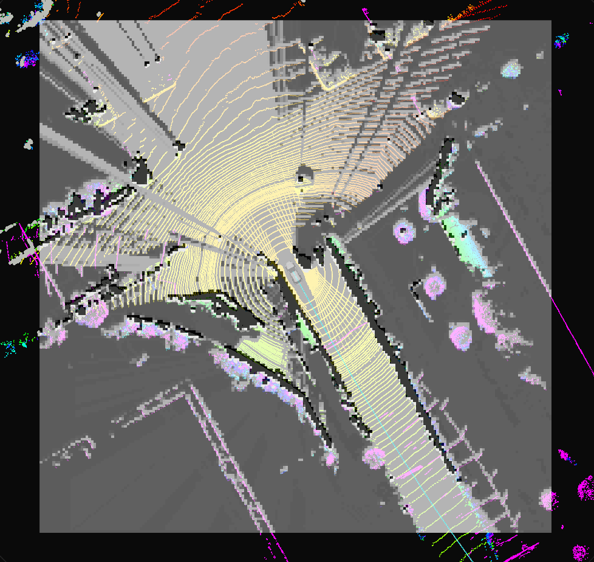
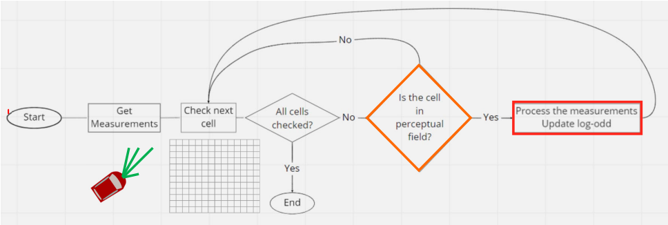
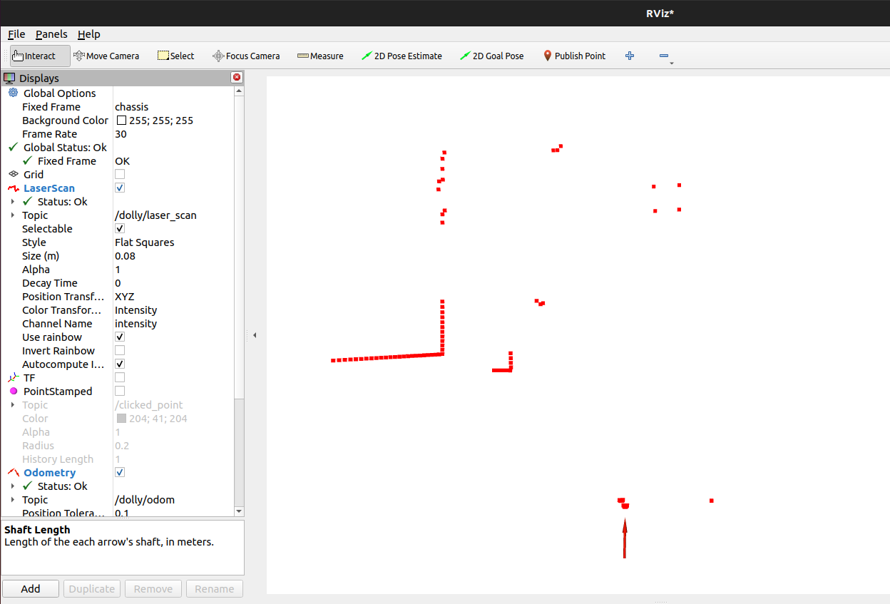
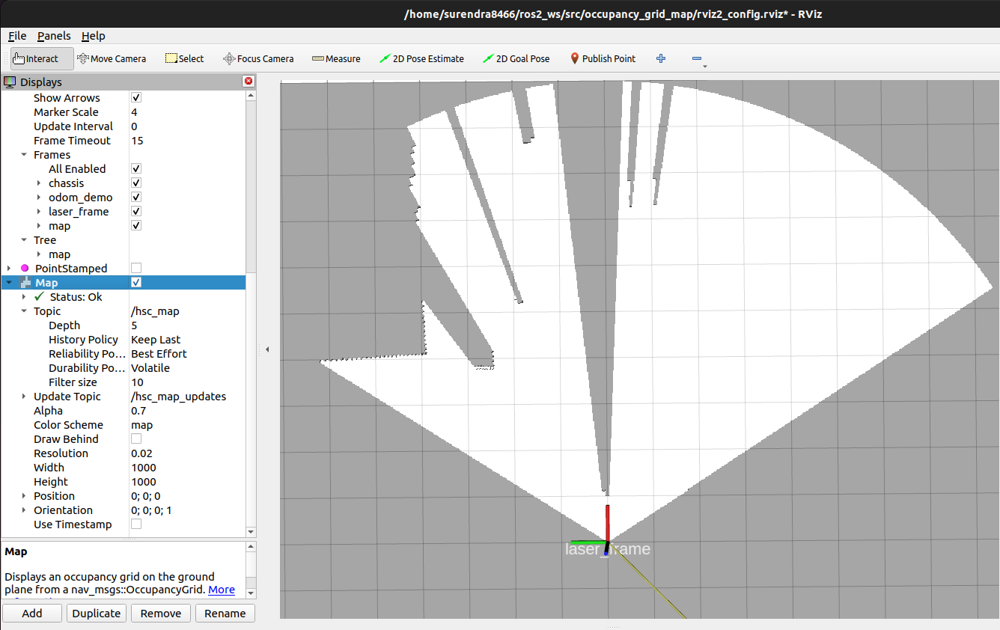

# Occupancy Grid Mapping with Dolly Laser Scan

This project implements an **Occupancy Grid Map** using **laser scan data from the Dolly robot**.  
An occupancy grid is a two-dimensional discretized representation of the environment, where each cell contains the **posterior probability** that the corresponding space is occupied by an obstacle.


<div align="center">
  
</div>
Source: https://autowarefoundation.github.io/autoware_universe/main/perception/autoware_probabilistic_occupancy_grid_map/laserscan-based-occupancy-grid-map/


---

## 📖 Concept

- **Occupancy Grid**  
  - Discrete 2D grid of cells.  
  - Each cell holds the probability of being **occupied**, **free**, or **unknown**.  
  - Map is updated based on range sensor data (LaserScan).  

- **Assumptions**  
  - Ego-position and heading are known exactly.  
  - Environment is static (no moving obstacles).  

- **Decision Approach**  
  - Bayesian update rule is used for occupancy estimation.  
  - States are binary: **Occupied** or **Free**.  
  - Probabilities are transformed into **log-odds** for stable numerical updates.  

---

## ⚙️ Algorithm Overview
<div align="center">
  
</div>

---

## 🛠️ Installation
1. Create workspace, src and go to src
```bash
mkdir temp_ws
cd temp_ws
mkdir src
cd src
```
2. Clone repository
```bash
git clone https://github.com/surendrakoganti/occupancy_grid_map.git
```
3. Return to workspace and build the package
```bash
cd ..
colcon build
```
4. Source the setup files
```bash
source install/setup.bash
```
---

## ▶️ Usage
1. Play ros bag file
```bash
ros2 bag play -l ./src/occupancy_grid_map/laser_scan_data/rosbag2_2021_05_09-18_39_42_0.db3 
```
2. Run the node in new terminal (in same directory as previous terminal):
```bash
ros2 run occupancy_grid_map hsc_mapping_laser
```
3. Launch Rviz2 in new terminal and add topic "hsc_map" to view the generated occupancy grid map.
---

## 🎯 Results
|Input laser scan data   | Occupancy grid map                |
|------------------------------|-----|
|||

---
